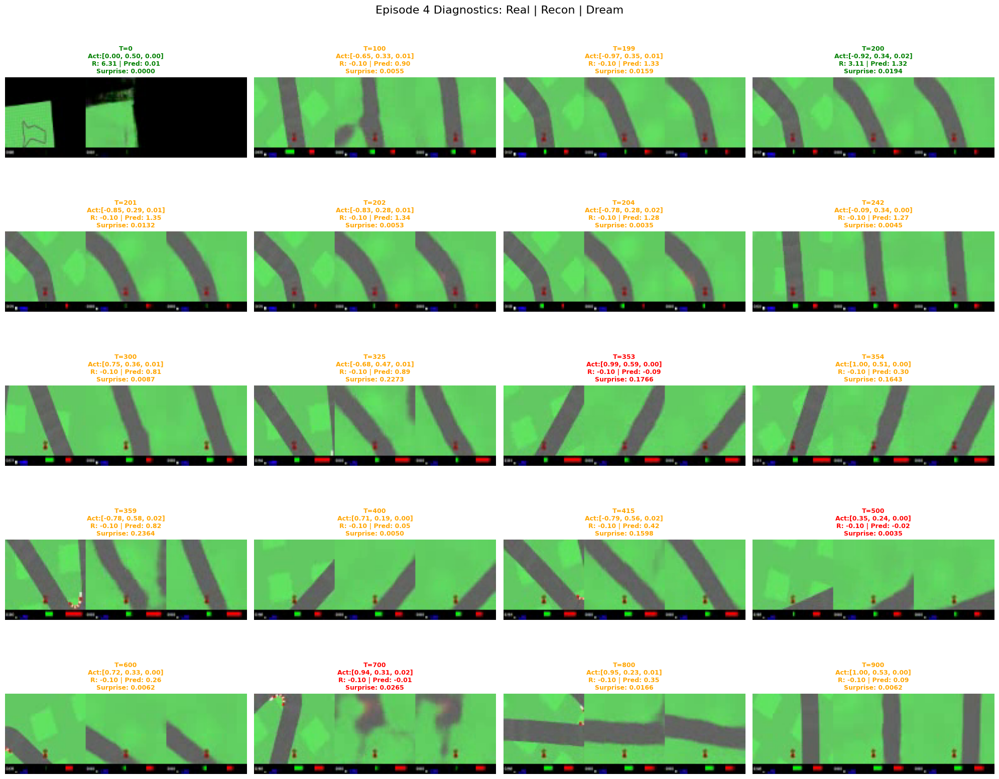

# World Models (JAX) on CarRacing-v3 & VizDoom

[](https://opensource.org/licenses/MIT)
[](https://www.python.org/downloads/)
[](https://github.com/google/jax)
[](https://arxiv.org/abs/1803.10122)

A JAX/Equinox implementation of [World Models (Ha & Schmidhuber, 2018)](https://worldmodels.github.io/) applied to the Gymnasium `CarRacing-v3` and `VizdoomTakeCover-v0` environments.


*(Visualization of Real Observation vs. VAE Reconstruction vs. RNN Dream)*

## 1. Overview

The agent consists of three independent components trained sequentially:

1.  **Vision (V):** A convolutional VAE that compresses the 64x64x3 frame into 32 latent dimensions for CarRacing or 64 for Doom.
2.  **Memory (M):** An MDN-RNN that predicts the next latent and termination. CarRacing also learns a reward head. Doom uses a separate Gaussian mixture per latent dimension and a weighted death loss.
3.  **Controller (C):** A linear policy evolved inside the dream environment. Doom uses both LSTM states, $[z_t,c_t,h_t]$, and scores actual survival steps, with unit reward per transition.

### Project Structure
```
.
├── src/                 # Core model definitions (JAX/Equinox)
│   ├── vae.py           # VAE architecture (Vision)
│   ├── rnn.py           # MDN-RNN architecture (Memory)
│   └── controller.py    # Linear Controller (Policy)
├── scripts/             # Helper tools
│   ├── data_collection/ # Distributed rollout collection
│   └── tools/           # Debugging & visualization
├── diagnostics/         # Debug outputs (filmstrips, grids)
├── train_dream.py       # Evolution Strategy (CMA-ES) loop
├── train_rnn.py         # World Model training script
├── train_rnn_packed.py  # Doom training with carried memory and packed streams
├── process_data.py      # Data preprocessing pipeline
└── test_agent.py        # Final agent evaluation
```

## CarRacing Strategy: Asymmetric Reward Loss

This implementation introduces an **asymmetric loss function** that addresses the critical "Sim2Real gap" in World Models. The standard approach often leads to "optimism bias" where the RNN hallucinates safer outcomes than reality provides.

The asymmetric loss punishes overestimation of rewards (optimism) 5x more than underestimation (pessimism):

```python
# Penalize "Optimism" (Pred > Actual) significantly more than "Pessimism"
asymmetric_weight = jnp.where(diff > 0, 5.0, 1.0)
loss_reward = jnp.mean(asymmetric_weight * (diff ** 2))
```

This enables robust transfer from dream to reality, achieving human-level performance (843.0 score) without requiring massive datasets.

Doom has a constant reward of one per survived transition, including the terminal
transition. Its reward prediction is not a survival probability. Doom controller
training therefore uses the death head and unit rewards; death detection and
real-game evaluation are the relevant checks.

## 2. Installation

### Prerequisites
*   Python 3.12+
*   CUDA-enabled GPU (Recommended)
*   **Mac Users:** You may need to install `swig` to build Box2D (`brew install swig`).

### Setup
Using [uv](https://github.com/astral-sh/uv) (Recommended):
```bash
# Clone the repo
git clone https://github.com/Sha01in/world-models-jax.git
cd world-models-jax

# Initialize and sync environment
# This installs the locked JAX/CUDA 13 stack on Linux/WSL2
uv sync --python 3.12

# For Mac (Apple Silicon) users who want Metal acceleration:
# uv pip install "jax-metal"
```

> [!IMPORTANT]
> **Windows Users:** To enable GPU support, you **must** use [WSL2](https://learn.microsoft.com/en-us/windows/wsl/install). Native Windows installations will default to CPU-only mode because JAX does not support GPU on Windows directly.

### Verify Installation
Check if JAX can access your GPU:
```bash
uv run python scripts/tools/check_gpu.py
```
The check requires CUDA and exits with an error on CPU fallback. It verifies a
synchronized matrix multiplication and a convolution backward pass. For GPU runs,
set `JAX_PLATFORMS=cuda`; this also prevents silent CPU training.

Or using standard pip:
```bash
pip install -r requirements.txt
# Note: requirements.txt is generated for Linux/CUDA. 
# On Mac/Windows, you may need to manually adjust JAX versions.
```

Run the Doom regression checks without writing training data or checkpoints:
```bash
uv run python -m unittest tests.test_doom_config tests.test_doom_training
```
The older `run_pipeline_test.py` writes default data/checkpoint paths; use a
disposable checkout for that script.

## 3. Usage Pipeline

The World Model is trained in a strict pipeline. Each step depends on the previous one. You must specify the environment using `--env`.
Supported environments: `CarRacing-v3` (Default), `VizdoomTakeCover-v0`.

### Example: Doom Pipeline
For Doom, use `--env VizdoomTakeCover-v0` on pipeline commands. Use a fresh
processed-data directory for each VAE/data version; processing records stable
episode IDs and the VAE hash. The stored reward and death label at index `t`
belong to the action taken from observation `t`; a time limit is not a death label.

The following uses an already trained Doom VAE and stores experimental checkpoints
separately. The paper's solve criterion is mean survival above 750 over 100 real
episodes, with a 2100-step cap. High dream scores alone do not establish a solution.

```bash
export JAX_PLATFORMS=cuda
export XLA_PYTHON_CLIENT_PREALLOCATE=false
uv run python scripts/tools/check_gpu.py
uv run python process_data.py --env VizdoomTakeCover-v0 \
  --output_dir data/series/VizdoomTakeCover-v0-v2
mkdir -p checkpoints/VizdoomTakeCover-v0/experiment
cp checkpoints/VizdoomTakeCover-v0/vae.eqx checkpoints/VizdoomTakeCover-v0/experiment/vae.eqx
uv run python train_rnn.py --env VizdoomTakeCover-v0 --epochs 20 --batch_size 32 \
  --data_dir data/series/VizdoomTakeCover-v0-v2 \
  --output checkpoints/VizdoomTakeCover-v0/experiment/rnn.eqx
uv run python scripts/tools/audit_doom.py --heldout \
  --rnn checkpoints/VizdoomTakeCover-v0/experiment/rnn.eqx
uv run python train_dream.py --env VizdoomTakeCover-v0 --strategy jax_cma \
  --checkpoint_dir checkpoints/VizdoomTakeCover-v0/experiment \
  --data_dir data/series/VizdoomTakeCover-v0-v2 \
  --pop_size 64 --rollouts 16 --generations 500 --temperature 1.15
uv run python scripts/tools/evaluate_doom.py \
  --checkpoint-dir checkpoints/VizdoomTakeCover-v0/experiment \
  --episodes 100 --seed 20000 --output artifacts/doom_evaluation.json
```
The default death cutoff matches the reference implementation. `--done_mode sampled`
is an optional experiment that samples death after undoing the death-loss class
weighting; it is a different simulator protocol and should be reported separately.
Old checkpoints remain readable. New RNN checkpoints need their `.json` sidecar,
and controller checkpoints record memory, posterior-sampling, and action conventions.

The [VizDoom reproduction audit](docs/vizdoom_reproduction.md) records the measured
GPU performance, implementation fixes, dataset checks and real-game results.

For the longer reference training budget, supply a JSON manifest with separate
`training_files` and `validation_files`, each listing episode `.npz` paths:

```bash
uv run python train_rnn_packed.py --manifest artifacts/doom_split.json \
  --output checkpoints/VizdoomTakeCover-v0/long_experiment/rnn.eqx \
  --epochs 400 --batch-size 100 --seq-len 500
```
This requires CUDA, carries memory between chunks, resets at episode boundaries,
and saves a separate `rnn_best.eqx` selected by held-out loss. Copy its matching VAE
and keep its JSON sidecar when preparing a controller-training directory.

### Step 1: Data Collection
Collect initial data to train the Vision model.
```bash
python collect_data.py --env CarRacing-v3
# Select Option 1: Random (Brownian Noise)
```
*Goal: ~2,000 - 5,000 episodes.*

*Note: Unlike the original paper which suggests 10,000 random episodes, I use a **Curriculum Learning** approach (see Section 4). I start with a smaller random dataset, train the agent, find where it fails, and then collect specific "failure" data. This is more efficient than random sampling.*

### Step 2: Train Vision (VAE)
Train the VAE to compress images.
```bash
python run_vae_training.py --env CarRacing-v3
```

### Step 3: Process Data
Encode all collected images into latent vectors ($z$) and save them for RNN training.
```bash
python process_data.py --env CarRacing-v3
```

### Step 4: Train Memory (RNN)
Train the MDN-RNN to predict the future.
```bash
python train_rnn.py --env CarRacing-v3
```
*Note: This implementation uses an **Asymmetric Loss** to punish "Optimism" (predicting high rewards when crashing), which fixes the Sim2Real gap.*

### Step 5: Train Controller (Dreaming)
Evolve the controller inside the RNN.
```bash
python train_dream.py --env CarRacing-v3
```

### Step 6: Test & Visualize
Run the trained agent in the real environment.
```bash
python test_agent.py --env CarRacing-v3
```

## 4. Iterative Improvement (Sim2Real2Sim)

To achieve high scores (>800) without needing massive random datasets, I use an iterative data collection strategy:

1.  **Recovery Data:** (Option 3) Heuristic driver with noise to teach the RNN how to recover from bad states.
2.  **Aggressive Data:** (Option 4) Heuristic driver that drives too fast, teaching the RNN about friction limits.
3.  **On-Policy Failures:** (Option 5) Run your current agent, let it crash, and add that data to the training set.

**Workflow:**
1.  Collect ~2k Random Episodes -> Train V, M, C.
2.  Observe Failures (e.g., Agent spins out on sharp turns).
3.  Collect ~500 "On-Policy" or "Aggressive" episodes.
4.  Retrain M (RNN) with the new data.
5.  Retrain C (Controller).
6.  Repeat.

This **Active Learning** loop fixes the "Sim2Real Gap" (where the RNN hallucinates that driving on grass is safe) much faster than simply adding more random data.

## 5. Results

### VizDoom reproduction audit (2026-10-02)

The refined policy scored **840.06 ± 524.48 survival steps over 100 fresh games**
(seeds 30000–30099), versus **227.57 ± 111.85** for the original policy on the same
seeds. This meets the paper's mean >750/100-game solve criterion on that test,
but remains below its reported 1092 mean. The mean's bootstrap 95% interval is
741.16–946.20; one test does not establish a population mean above 750.
This experiment uses sampled-death dreams and mean-latent real inference with
the existing VAE and full-frame preprocessing. See the
[audit](docs/vizdoom_reproduction.md) for selection, uncertainty and protocol details.
The frozen checkpoint directory is
`checkpoints/VizdoomTakeCover-v0/reproduction_refined_selected/` (local model files,
not committed to Git).

### The Winning Recipe
To achieve the score of **843.0**, I used the following dataset composition (~4,000 episodes total):
*   **2,000 Random Episodes:** Initial training of V and M.
*   **500 Recovery Episodes:** Heuristic driver with noise (teaching recovery).
*   **500 Aggressive Episodes:** Heuristic driver entering corners too fast (teaching friction limits).
*   **500 On-Policy Failure Episodes:** **Critical Step.** I ran the agent, let it crash (due to "optimism delusions"), and added this specific data to the training set.

*   **Episode Score:** 843.0 (Solved)
*   **Behavior:** Robust navigation of sharp turns; recovery from minor slips.

*Note on Reproducibility: While the training scripts use fixed seeds for JAX operations (`PRNGKey(0)`), the data collection process (Sim2Real) involves real-time interaction with the Box2D physics engine, which can have non-deterministic elements across different hardware/OS. Exact score matching may vary, but the general learning curve should be consistent.*

## 6. Credits
*   Original Paper: [World Models](https://arxiv.org/abs/1803.10122) by David Ha and Juergen Schmidhuber.
*   Environment: [Gymnasium](https://github.com/Farama-Foundation/Gymnasium).
*   Framework: [JAX](https://github.com/google/jax) & [Equinox](https://github.com/patrick-kidger/equinox).

## 7. Technical Notes: The JAX Advantage

This project demonstrates a **Hybrid Architecture**:

1.  **GPU-Accelerated Dreaming:**
    The most significant advantage of JAX is in `train_dream.py`. I use `jax.vmap` to simulate the RNN "dreams" for the **entire population (256 agents)** simultaneously on the GPU. This turns the Evolution Strategy evaluation which is usually a slow sequential process into a single efficient batched operation.

2.  **CPU-Bound Reality:**
    Since `CarRacing-v3` is based on Box2D (CPU physics), the *real* environment interaction cannot be JIT-compiled. I handle this via:
    *   **Data Collection:** Standard Python `multiprocessing` to run parallel environments on CPU.
    *   **Inference:** Using JAX on CPU (worker threads) or GPU (main agent) depending on the bottleneck.

This approach leverages JAX where it excels (massive parallel simulation) while accommodating standard Gym environments.

